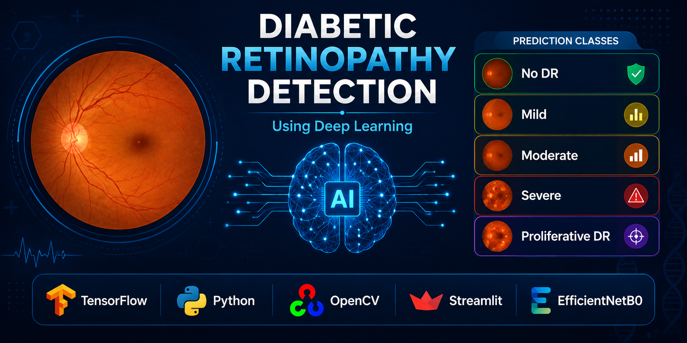
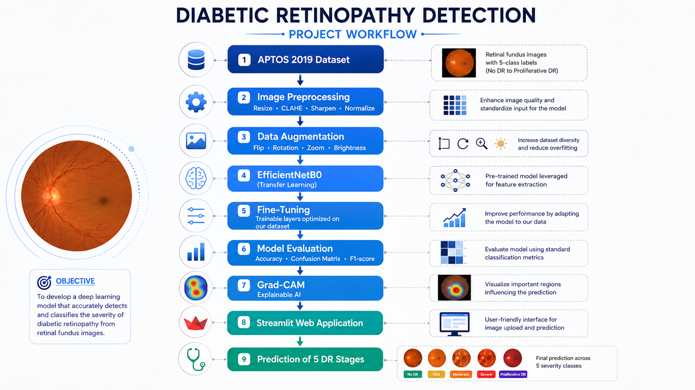
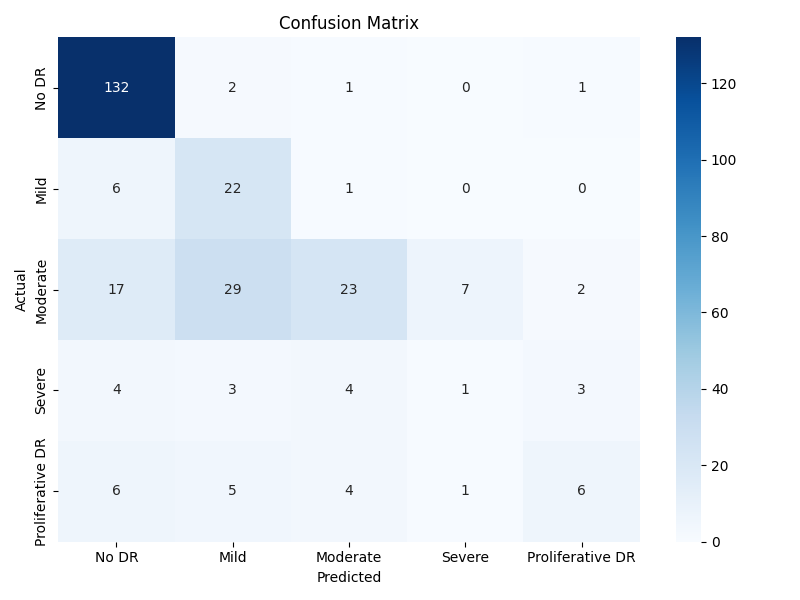
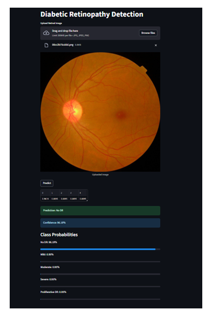
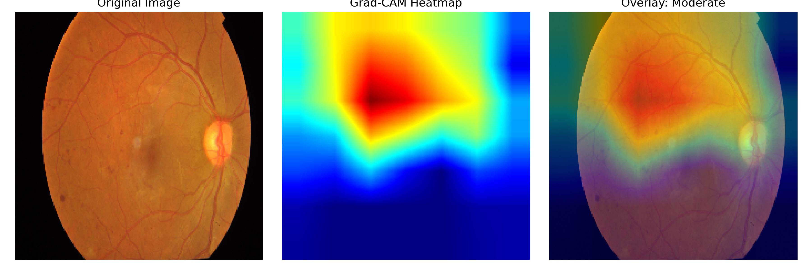

# 🩺 Diabetic Retinopathy Detection Using Deep Learning



An end-to-end Deep Learning project that automatically detects and classifies **five stages of Diabetic Retinopathy (DR)** from retinal fundus images using **EfficientNetB0**. The project also integrates **Grad-CAM** for explainable AI and a **Streamlit web application** for real-time prediction.

---

# 📌 Project Overview

Diabetic Retinopathy (DR) is one of the leading causes of blindness among diabetic patients. Early detection is essential to prevent irreversible vision loss.

This project develops an AI-powered medical imaging system capable of automatically classifying retinal fundus images into five stages of Diabetic Retinopathy using Transfer Learning and Computer Vision techniques.

---

# 🔄 Project Workflow



The project follows an end-to-end deep learning pipeline:

* APTOS 2019 Dataset
* Image Preprocessing
* Data Augmentation
* EfficientNetB0 Transfer Learning
* Fine-Tuning
* Model Evaluation
* Grad-CAM Explainability
* Streamlit Deployment

---

# 🎯 Objectives

* Detect Diabetic Retinopathy automatically
* Classify retinal images into five severity stages
* Improve image quality using preprocessing techniques
* Provide explainable AI predictions using Grad-CAM
* Deploy the model through Streamlit

---

# 📊 Dataset

**Dataset:** APTOS 2019 Blindness Detection (Kaggle)

The dataset contains retinal fundus images labeled into five classes.

| Label | Class            |
| ----- | ---------------- |
| 0     | No DR            |
| 1     | Mild             |
| 2     | Moderate         |
| 3     | Severe           |
| 4     | Proliferative DR |

Dataset Link:

https://www.kaggle.com/competitions/aptos2019-blindness-detection

---

# 🧠 Model Architecture

* EfficientNetB0 (Transfer Learning)
* TensorFlow / Keras
* Fine-Tuning
* Softmax Classification
* Five-Class Prediction

---

# 🖼 Image Preprocessing

The preprocessing pipeline includes:

* Image resizing (224 × 224)
* CLAHE (Contrast Enhancement)
* Gaussian Blur
* Image Sharpening
* Pixel Normalization
* Data Augmentation

---

# 📊 Model Performance



| Metric              | Result |
| ------------------- | ------ |
| Validation Accuracy | ~71%   |
| Test Accuracy       | ~67%   |

Evaluation Metrics:

* Accuracy
* Precision
* Recall
* F1-Score
* Confusion Matrix
* Classification Report

---

# 🖥 Streamlit Web Application



The Streamlit application allows users to:

* Upload retinal fundus images
* Predict Diabetic Retinopathy stage
* Display confidence score
* Show class probabilities
* Provide real-time prediction

---

# 🔥 Explainable AI (Grad-CAM)



Grad-CAM highlights the retinal regions that contributed most to the model's prediction, improving transparency and helping clinicians better understand the AI's decision-making process.

---

# 🛠 Tech Stack

* Python
* TensorFlow
* Keras
* OpenCV
* NumPy
* Pandas
* Matplotlib
* Scikit-learn
* Streamlit
* Git
* GitHub

---

# 📂 Project Structure

```
Diabetic-Retinopathy-Detection/
│
├── app/
├── assets/
├── data/
├── model/
├── outputs/
├── src/
├── README.md
└── requirements.txt
```

---

# 🚀 Future Improvements

* Improve Severe DR detection
* Increase model accuracy using larger datasets
* Hyperparameter optimization
* Cloud deployment
* Mobile application integration

---

# 👨‍💻 Author

**Durvesh Dhapudkar**

🎓 MSc Data Science
Arden University Berlin

GitHub:
https://github.com/Durvesh2107

LinkedIn:
(Add your LinkedIn profile URL here)

---

⭐ **If you found this project useful, consider giving it a Star!**
